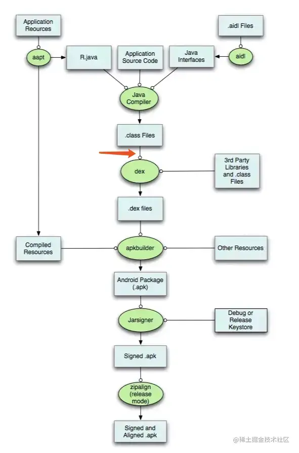

## 1. 背景

我们期望通过插桩的方式实现按键防抖的效果，如下所示：

```kotlin
 // 插桩前
 btn.setOnClickListener {
        Toast.makeText(this@MainActivity, "button clicked", Toast.LENGTH_SHORT).show()
 }
 // 插桩后
 btn.setOnClickListener {
        if(Utils.isFastClick()){
                return
        }
        Toast.makeText(this@MainActivity, "button clicked", Toast.LENGTH_SHORT).show()
 }
```

插桩涉及到 ASM 和 Transform 相关的知识，本文将对 Transform 进行基本的介绍。

## 2. Transform

仅仅能够使用 ASM 进行插桩还不够，现在我们面临的问题是，如果需要对我们的 app 项目中所有的 class 进行插桩，难道需要我们自己获取编译后的 class 文件，经过处理后再输出出来，再统一交给 AGP 进行重新构建打包吗？肯定不是这样，AGP 的作用就是构建 Android 项目，它自己也需要对 class 文件进行处理，比如将 class 转化为 dex 文件，进行压缩、混淆等步骤，这里 AGP 也提供了相应的 API 供我们完成类似的功能，也就是下面提到的 Transform API，我们要想让我们的 ASM 成功作用到 class 文件上（也就是为我们的 ClassReader 提供要处理的 class 文件），就需要依靠 Transform API。

Transform 作用的位置：


Transform 在 AGP 1.5 引入，用来在 app 构建过程中对 class、jar、资源文件做中间操作的 API。比如我们可以通过 ASM 去做字节码的插桩，Google 官方对 Transform 的一个典型应用就是 R8 工具，来对代码进行 desugar、混淆、压缩等操作。

AGP 8 之后 Transform 由于效率问题被废弃，Google 官方提供了两套 API 来替代 Transform API 的功能。

### 2.1. AGP 8 前的 Transform API

#### 2.1.1. 使用流程

我们可以自定义 Transform 来实现对 class、jar、资源文件的处理。这里自定义的 Transform 会被 AGP 转换成一个 Task 去在构建过程中执行。大致的一个流程和关系：

1.  自定义 Transform，继承 Transform 类，实现其中主要的 abstract 方法

    1.  `getName()`、`getInputTypes`、`getScopes`、`isIncremental`、`transform`

    2.  `getName()`定义名称；`getInputTypes`、`getScopes`确定要处理的哪些文件以及处理哪些范围的文件；`isIncremental`用作判定是否支持增量编译，`transform`是转换处理的核心方法

2.  通过 Gradle 脚本/ 插件来完成 Transform 的注册，AGP 会将 Transform 转换为 task，挂载到构建的流程中执行

##### 2.1.1.1. 自定义 Transform

```kotlin
 class MyCustomTransform : Transform() {
 ​
        /**
          * 设置我们自定义 Transform 对应的 Task 名称，Gradle 在编译的时候，会将这个名称经过一些拼接显示在控制台上
          */
        override fun getName(): String {
                return "ErdaiTransform"
        }
 ​
        /**
          * 项目中会有各种各样格式的文件，该方法可以设置 Transform 接收的文件类型
          * 具体取值范围：
          * CONTENT_CLASS：Java 字节码文件，
          * CONTENT_JARS：jar 包
          * CONTENT_RESOURCES：资源，包含 java 文件
          * CONTENT_DEX：dex 文件
          * CONTENT_DEX_WITH_RESOURCES：包含资源的 dex 文件
          *
          * 我们能用的就两种：CONTENT_CLASS 和 CONTENT_JARS
          * 其余几种仅 AGP 可用
          */
        override fun getInputTypes(): MutableSet<QualifiedContent.ContentType> {
                return TransformManager.CONTENT_CLASS
        }
 ​
        /**
          * 定义 Transform 检索的范围：
          * PROJECT：只检索项目内容
          * SUB_PROJECTS：只检索子项目内容
          * EXTERNAL_LIBRARIES：只检索外部库，包括当前模块和子模块本地依赖和远程依赖的 JAR/AAR
          * TESTED_CODE：由当前变体所测试的代码（包括依赖项）
          * PROVIDED_ONLY：本地依赖和远程依赖的 JAR/AAR（provided-only）
          */
        override fun getScopes(): MutableSet<in QualifiedContent.Scope> {
                return TransformManager.SCOPE_FULL_PROJECT
        }
 ​
        /**
          * 表示当前 Transform 是否支持增量编译 true：支持 false：不支持
          */
        override fun isIncremental(): Boolean {
                return false
        }
 ​
        /**
          * 进行具体的检索操作
          */
        override fun transform(transformInvocation: TransformInvocation?) {
                printLog()
                transformInvocation?.inputs?.forEach {
                        // 一、输入源为文件夹类型
                        it.directoryInputs.forEach { directoryInput ->
                                //1、针对文件夹进行字节码操作，这个地方我们就可以做一些狸猫换太子，偷天换日的事情了
                                for (inputFile in FileUtils.getAllFiles(directoryInput.file)){
                                        if (inputFile.isFile && inputFile.name.endsWith(".class")){
                                                // 这里就是常规的 ASM 操作了，我们自定义的 Visitor 将作用于每个 class 文件
                                                val classReader = ClassReader(inputFile.inputStream())
                                                val classWriter = ClassWriter(classReader, ClassWriter.COMPUTE_MAXS)
                                                val costTimeClassVisitor = CustomClassVisitor(Opcodes.ASM9, classWriter)
                                                classReader.accept(costTimeClassVisitor, ClassReader.SKIP_DEBUG or ClassReader.SKIP_FRAMES)
                                                val fos = inputFile.outputStream()
                                                fos.write(classWriter.toByteArray())
                                        }
                                }
                                //先对字节码进行修改，在复制给 dest
                                //2、构建输出路径 dest
                                val dest = transformInvocation.outputProvider.getContentLocation(
                                        directoryInput.name,
                                        directoryInput.contentTypes,
                                        directoryInput.scopes,
                                        Format.DIRECTORY
                                )
                                //3、将文件夹复制给 dest ，dest 将会传递给下一个 Transform
                                FileUtils.copyDirectory(directoryInput.file, dest)
                        }
 ​
                        // 二、输入源为 jar 包类型
                        it.jarInputs.forEach { jarInput ->
                                //1、TODO 针对 jar 包进行相关处理
 ​
                                //2、构建输出路径 dest
                                val dest = transformInvocation.outputProvider.getContentLocation(
                                        jarInput.name,
                                        jarInput.contentTypes,
                                        jarInput.scopes,
                                        Format.JAR
                                )
                                //3、将 jar 包复制给 dest，dest 将会传递给下一个 Transform
                                FileUtils.copyFile(jarInput.file, dest)
                        }
                }
        }
 ​
        /**
          * 打印一段 log 日志
          */
        fun printLog() {
                println()
                println("******************************************************************************")
                println("******                                                                  ******")
                println("******          Welcome to use ErdaiTransform Plugin                    ******")
                println("******                                                                  ******")
                println("******************************************************************************")
                println()
        }
 ​
 }
```

##### 2.1.1.2. 注册 Transform

```kotlin
 class CustomTransformPlugin: Plugin<Project> {
 ​
        override fun apply(project: Project) {
                println("Hello CustomTransformPlugin")
 ​
                //新增的代码
                // 1、获取 Android 扩展
                val androidExtension = project.extensions.getByType(AppExtension::class.java)
                // 2、注册 Transform
                androidExtension.registerTransform(MyCustomTransform())
                // 在此之后 app 构建时就会执行相应的 transform task
        }
 }
```

### 2.2. AGP 8 后的变更方案

AGP 8 之后 Transform 由于效率问题被废弃，Google 官方提供了两套 API 来替代 Transform API 的功能。

详情可参考官方提供的信息：[Prepare your Android Project for Android Gradle plugin 8.0 API changes](https://android-developers.googleblog.com/2022/10/prepare-your-android-project-for-agp8-changes.html)

分为 Instrumentation API 和 Artifact API 两种方案，其中 Artifact 更加灵活，能满足更多场景，Instrumentation 使用上更加简单，不过能覆盖的场景更窄，详情参考 Booster 框架作者的博客：[Booster 如何适配 AGP 8.0？](https://johnsonlee.io/2023/05/29/how-booster-supports-agp-8/)

本次插桩通过 Instrumentation 即可满足，所以下面简要介绍其使用流程

#### 2.2.1. 使用流程

大致的流程分为两步：

1. 自定义 AsmClassVisitorFactory，实现 AsmClassVisitorFactory 的两个抽象方法

   ```kotlin
    abstract class CustomAsmClassVisitorFactory :
           AsmClassVisitorFactory<InstrumentationParameters.None> {
           // 直接返回我们的自定义 Visitor 即可，其他工作已经被封装好
           override fun createClassVisitor(
                   classContext: ClassContext,
                   nextClassVisitor: ClassVisitor
           ): ClassVisitor {
                   return CustomClassVisitor(classContext, Opcodes.ASM9, nextClassVisitor)
           }
    ​
           // 根据 class 的基本信息来判定是否对它进行处理，true 处理，false 不处理
           override fun isInstrumentable(classData: ClassData): Boolean {
                   return true
           }
    }
   ```

2. 注册 transform 任务

   ```kotlin
    class CustomPlugin : Plugin<Project> {
           override fun apply(target: Project) {
                   val androidComponents = target.extensions.getByType(AndroidComponentsExtension::class.java)
                   androidComponents.onVariants { variant ->
                           variant.instrumentation.transformClassesWith(
                                   CustomAsmClassVisitorFactory::class.java,
                                   InstrumentationScope.PROJECT // PROJECT 仅应用到引用插件的项目，ALL 可以延申到它依赖的其他库
                           ) {}
                           variant.instrumentation.setAsmFramesComputationMode(
                                   FramesComputationMode.COMPUTE_FRAMES_FOR_INSTRUMENTED_METHODS // 仅对修改的方法的栈帧大小进行重新计算
                           )
                   }
           }
    ​
    }
   ```

完成后，AGP 将在构建过程中执行一个 task 来完成插桩工作，效果和 Transform API 一样，肉眼可见代码量明显变少了。

### 2.3. 总结 & 参考

上面的介绍较为简单，更多细节可从下面的链接获取：

1.  Transform API

    *   [Gradle 系列（8）其实 Gradle Transform 就是个纸老虎](https://juejin.cn/post/7098752199575994405)

    *   [Gradle 系列 （五）、自定义 Gradle Transform](https://juejin.cn/post/7159841721856032804)

    *   [Gradle 系列 （六）、Gradle Transform + ASM + Javassist 实战](https://juejin.cn/post/7160296095170428965)

2.  AGP 8 变更

    *   [AGP 8 API 变更及替代方案-官方文档](https://developer.android.com/build/releases/gradle-plugin-api-updates?hl=zh-cn)

    *   [Prepare your Android Project for Android Gradle plugin 8.0 API changes](https://android-developers.googleblog.com/2022/10/prepare-your-android-project-for-agp8-changes.html)

    *   [新 API 使用示例仓库](https://github.com/android/gradle-recipes)

    *   [Booster 如何适配 AGP 8.0？](https://johnsonlee.io/2023/05/29/how-booster-supports-agp-8/)

    *   [ARouter适配 AGP 8.0 + 方案](https://juejin.cn/post/7288964017351393321)

    *   [Gradle插件AGP8.1.2适配指南](http://cf.myhexin.com/pages/viewpage.action?pageId=1048757432)

    *   [AGP8.0 时代的 Transform 实践](https://juejin.cn/post/7240371866287407163)
