# 前言 & 背景

研究仓颉主要原因在于它在运行性能和并发编写体验这两点上相比 ArkTS 有优势，对其进行了初步调研，考虑将仓颉引入我们鸿蒙开发中：

这次针对将仓颉应用于鸿蒙端业务 SDK，基于这个目标对仓颉开发进行进一步的体验与实践，进行 SDK 落地可行性上的调研。

# 仓颉鸿蒙开发概况

## 其他厂商实践情况

多家厂商将仓颉应用于鸿蒙完成落地与上线。

- [中国工商银行-使用仓颉开发工行APP“收支日历”关键模块，滑动流畅性提升30%](https://mp.weixin.qq.com/s/3wSDPR96__1nk3Sw-tMkKw?token=1545268685&lang=zh_CN)
- [泛微-仓颉版易秒办APP高频场景时延降低30%](https://mp.weixin.qq.com/s/F0ockm4f0gxSE5oYfOVxww?token=1958715658&lang=zh_CN)
- [京东-使用仓颉优化小程序启动时间](https://mp.weixin.qq.com/s?__biz=Mzg4NDY1NzM0MA==&mid=2247500677&idx=1&sn=31755de478a1a3a87625b91e122c3f6f&chksm=cfb65e56f8c1d740bba6716e7c0851890bf788e8b2f512a13985a2b078c713fd3f7c4bd9869b&token=574879641&lang=zh_CN#rd)
- [力扣-全量仓颉开发鸿蒙](https://mp.weixin.qq.com/s/4Pc26wQ3g8t5-mINKGyidA)

前三个都是 ArkTS 项目嵌入仓颉模块（UI、逻辑），并且多集中于性能敏感场景，如网络请求，图片缓存等，全量使用仓颉的案例较少。

不过我们需要进行 SDK 开发，目前暂无使用仓颉进行 SDK 开发的案例。

## 语言亮点

### 相比 ArkTS 具有性能优势

以三方厂商实践给出的效果来看，性能提升大约在 20%+。内存占用低，性能表现佳。

### 并发编程使用较为简单

并发编程比较简单易用：

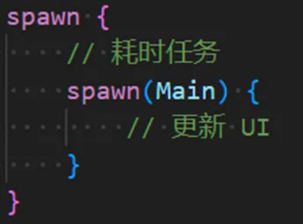

形式类似 Kotlin 协程，每个 spawn 代表一个仓颉线程，默认为工作线程，由系统进行调度，也可指定在 UI 线程执行。

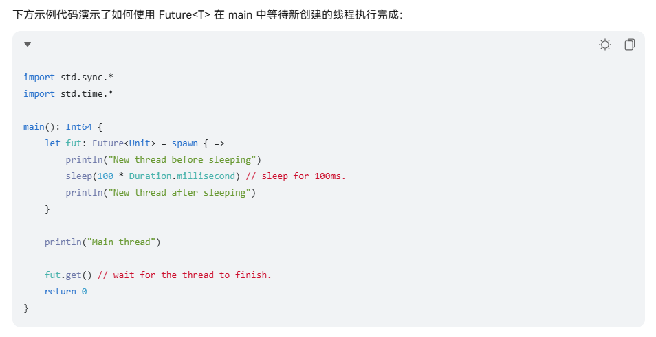

类似与 Kotlin 中的 async 用法，spawn 可以通过 get() 方法返回其结果，会阻塞当前线程。

## 仓颉开发方式梳理

### 纯仓颉开发

纯仓颉代码实现项目，UI + 逻辑。

### ArkTS + 仓颉混合开发

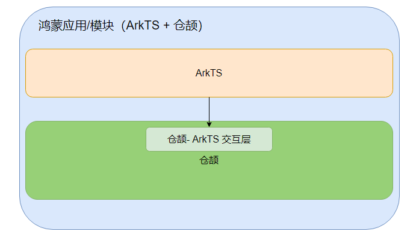

已有的 ArkTS 项目里面嵌入仓颉模块。同样仓颉模块既可以做 UI，也可以做逻辑。ArkTS 通过交互层调用仓颉模块。

# 使用仓颉开发鸿蒙 SDK 基本思路

SDK 的使用者是开发者，所以除了保证基本功能，SDK 的集成与使用体验也需要纳入考虑范围。

## 使用 ArkTS + 仓颉混合开发 SDK

正常来说 ArkTS 对仓颉的调用形式是这样的：

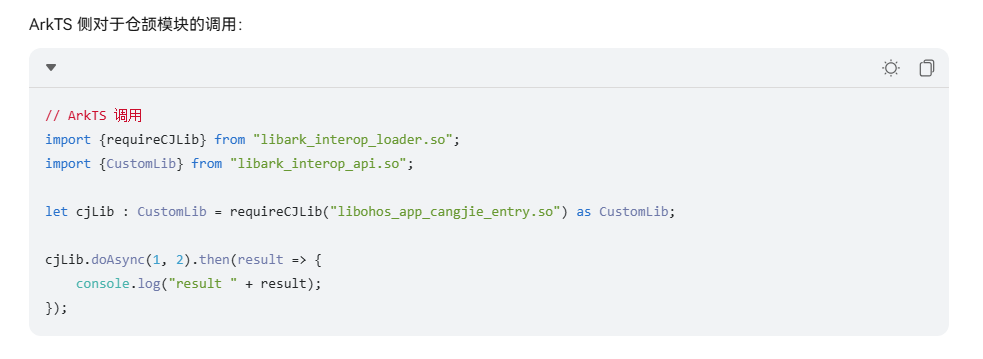

涉及到仓颉互操作库的使用，且需要正确指定 so 库名称。这要求 SDK 使用方添加仓颉工具链并启用仓颉开发，让 SDK 使用方通过这种方式使用很显然是不妥的，增加许多不必要的关注点，太过复杂。

因此我们需要在 SDK 的仓颉模块中进行一层 ArkTS 层封装，再导出 ArkTS 类/变量，让调用方像使用正常鸿蒙 HAR 包一样去使用仓颉模块：

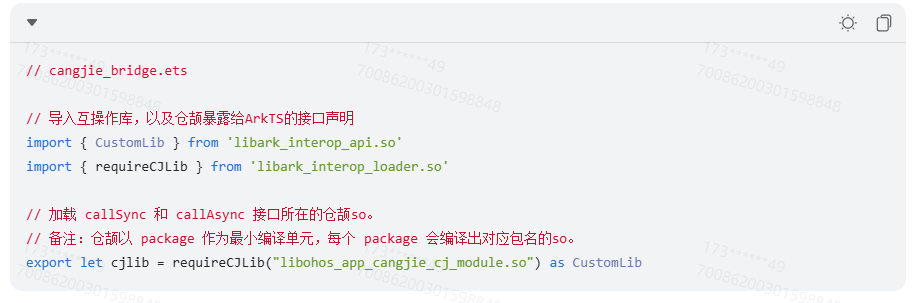

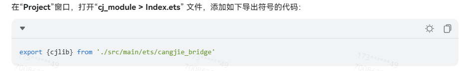

集成方引入 cjlib 即可正常使用

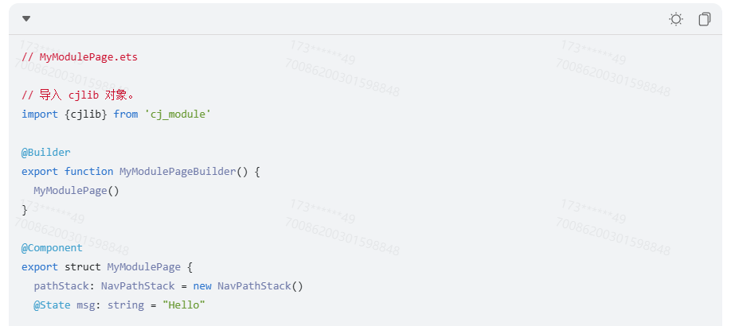

SDK 使用方角度看，其应用的架构如下：

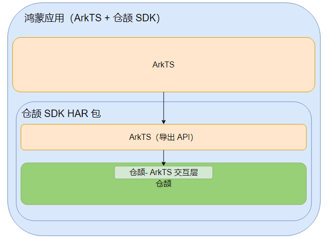

集成仓颉 SDK，调用其中 ArkTS 导出的 API，即可像使用正常鸿蒙 HAR 包一样去使用仓颉模块。

## 以 HAR 包形式进行集成

仓颉目前只支持 HAP 和 HAR 包的构建，开发 SDK 我们最终的产物也就是 HAR 包的形式。

# 现存问题

1. **仓颉代码分包之后，产物包体积会存在变大的问题**

    分包前：

   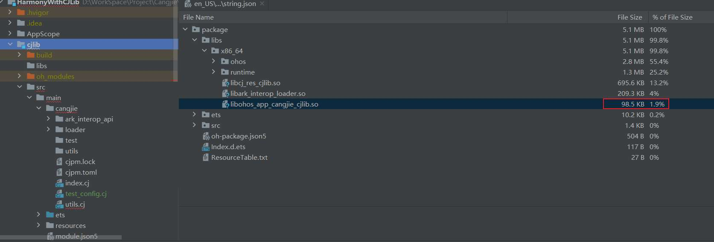

   分包后：

   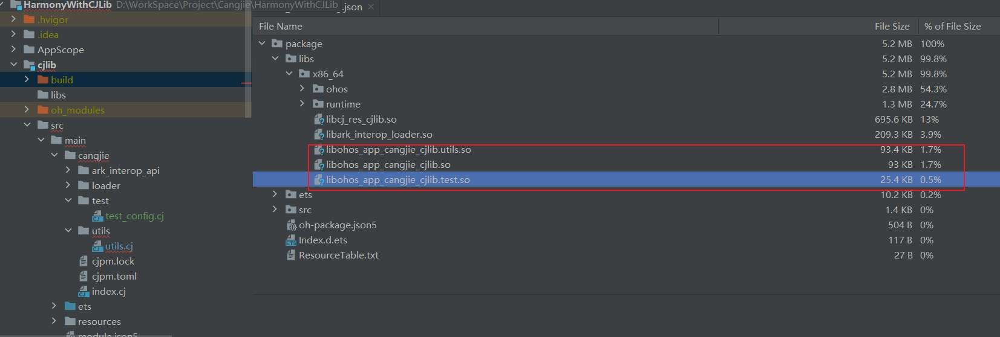

   华为回复：

   > 体积的问题，我们在下一个鸿蒙大版本里会把仓颉标准库、运行时等二进制下沉到系统镜像里，就不用打包到应用的hap包里去了
   >
   > 因为仓颉标准库现在是静态链接到业务的so里。标准库下沉到系统镜像里之后，业务就是动态链接到仓颉标准库了
   >
   > 标准库静态链接的话也是根据业务使用了哪些标准库，才会链接进来，并不会全部链接进来

   

2. **在 ArkTS 中加载仓颉模块，如果仓颉库中包名存在变动或者 cj 类移动到了别的包，需要修改加载仓颉 so 库的名称，规则为 仓颉模块名 + . + 包名 + .so**

   加载仓颉模块中某个互操作的类/函数，加载名称需要与声明类/函数的位置对应：
   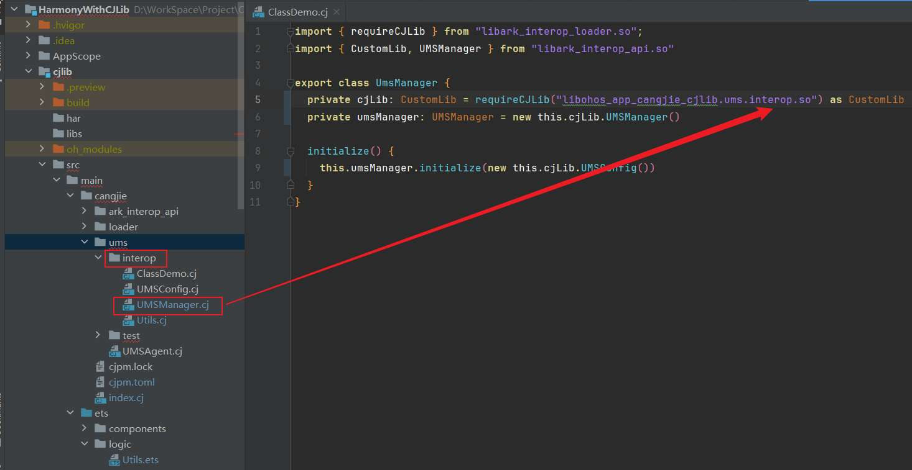

   如果包名变动/类移动位置，需同步修改加载的 so 库名称，如果不对应则崩溃：

   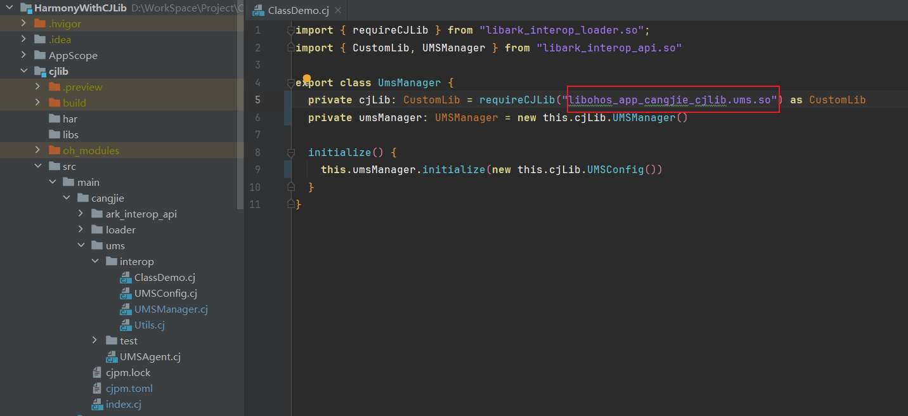

   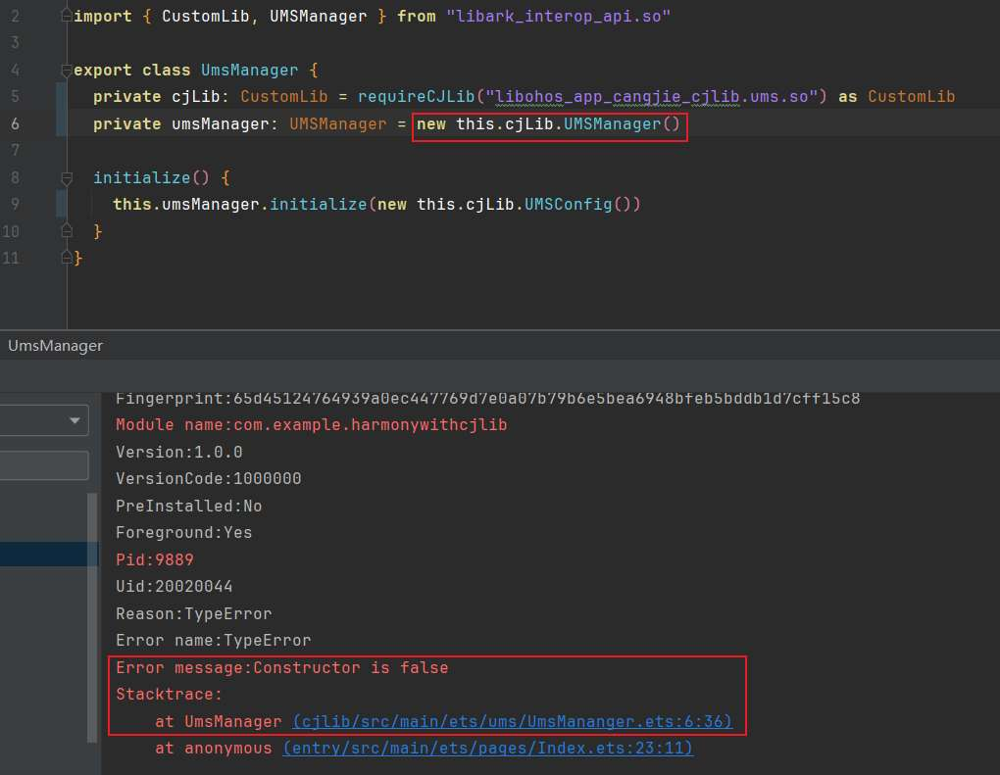

   这点不利于后期维护，不灵活。**

   **

3. **包间禁止循环 import**

   与 Java 以及 ArkTS 不同，仓颉对包间的 import 存在限制：

   - 比如有同包 A 的两个类，和另一个包 B 的类，B 引用了 A 中任何一个类，那么 A 包中所有类都不能引用 B

     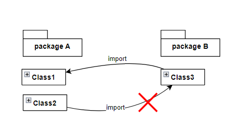

     

   - 另一种情况，三个包 A, B, C，C 引用了 B 的类，B 引用了 A 的类，那么 A 包所有类就不能再引用 C 包的类

     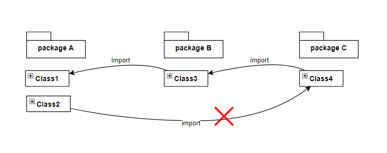

   
   对包间的引用限制较强，分包成为一中具有较大成本的操作（包体积增大、包间禁止循环引用）
   就产生了一种矛盾：
   如果不分包，代码量一旦增大，代码会变得不好组织；如果分包，会存在许多限制及包体积成本。

   由于分包问题较多，所以不分包反而可能是更好的选择，需要在文件命名上进行规范，比如使用下划线的方式进行分隔，hx_xxx_xxx.cj

   

4. **纯仓颉项目，只能源码集成其他仓颉模块，不支持 har 包等方式。**

   纯仓颉项目集成仓颉模块，只能仓颉源码集成，不支持 har 包集成。例子：[仓颉开源三方库](https://gitcode.com/Cangjie-TPC/TPC-Resource)，要集成这些库，都是采用源码集成（clone 到本地，或者用 git url 作为依赖）

   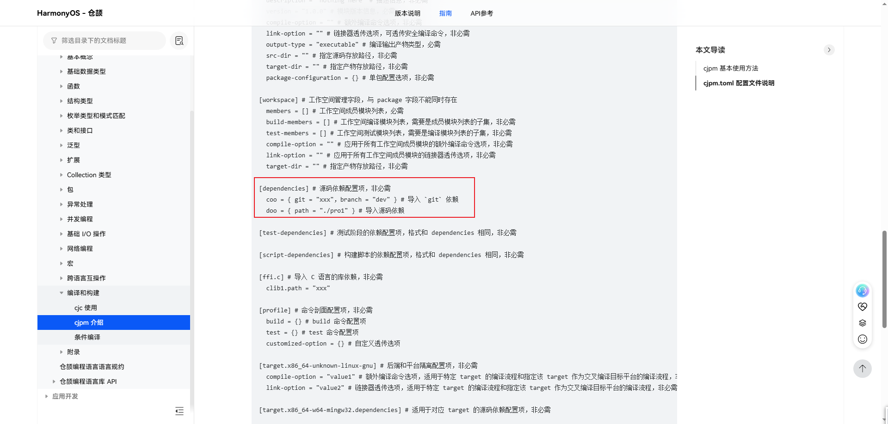

   

5. **仓颉侧调用 ArkTS 代码不便

   **仓颉侧不支持复用 ArkTS UI 资产。

   仓颉使用 ArkTS 逻辑的话，需要在 ArkTS 侧注册逻辑至仓颉侧，仓颉侧进行调用

   示例：
   第一步在仓颉侧编写互操作方法，提供给 ArkTS 侧进行逻辑注册

   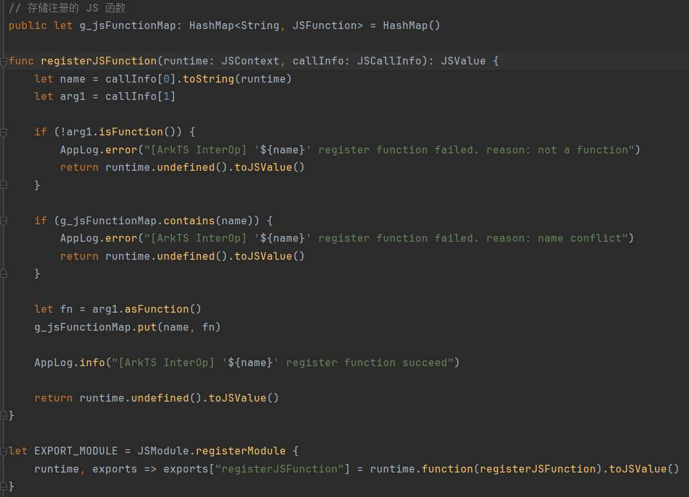

   第二步，在 ArkTS 侧调用该方法进行逻辑的注册。

   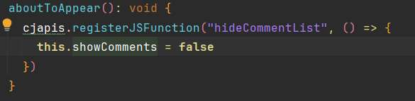

   第三步，注册完成后，在仓颉侧进行对应方法的调用

   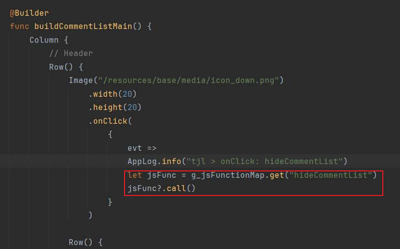

   仓颉要使用 ArkTS 侧逻辑，比较麻烦，不易维护。

   

6. **开发体验上，比如包名修改、补全、自动引包等机制，不够完善，部分场景存在问题。文档等方面目前仍然不够完善，遇到问题不易查找资料解决。
   
   **

   

7. **与 ArkTS 互操作上，限制较多，编写不便

   **有 2 种互操作方式，互操作宏和互操作库，前者编写成本较低，后者编写成本较高。

   
   互操作宏编写示例：

   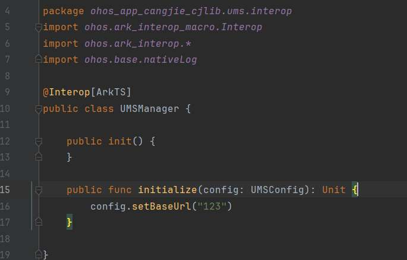

   此方式编写还是比较简单的，编写完即可在 ArkTS 侧调用，但也会存在一些限制，比如声明的方法不能传递非 @Interop 修饰的类型，此时需要使用互操作库的方式进行编写。

   
   互操作库编写示例，ArkTS 传递 context 给仓颉侧：

   \1. 通过互操作库声明函数
   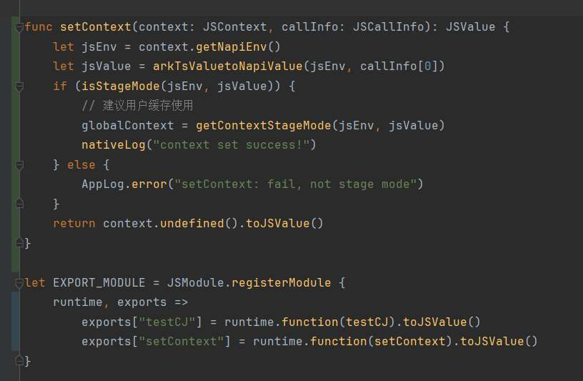

   \2. ArkTS 中引入仓颉 so 库，进行调用
   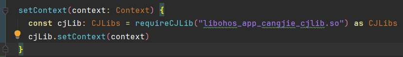

   这种方式编写较繁琐，且出错不易排查，可维护性和可读性较差。

   

   分包场景下，会存在另一个问题：

   如果用互操作库编写互操作逻辑，只有第一次 requireCJLib() 时的 so 库才能使用对应方法，之后再次 requireCJLib() 就没法使用了，会崩溃，报 is not callable. 推测属于仓颉 bug。

   如下是两个供 ArkTS 调用仓颉 so 库， CJLibs 为互操作库编写的，CustomLib 是互操作宏编写的。假如同时使用了这两种方式，会存在调用顺序上的问题，只有第一次加载的 so 库才能调用互操作库编写的函数。后续加载的 so 库，调用互操作库编写的函数会崩溃。

   如下编写方式可以正常运行：
   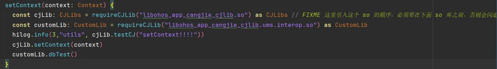

   
   如下的方式则会崩溃：
   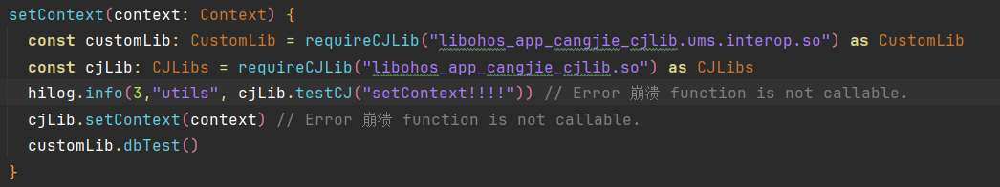

   

8. **兼容性问题**

   兼容性上，我们需要保证 2 点：
   \1. SDK 集成方使用，不会存在兼容性问题
   \2. 集成方编译后，在用户设备上运行，不会存在兼容性问题

   实践过程中，发现第二点无法满足，使用 API 14 配套仓颉工具链，无法在低版本 API 设备上正常运行，如 API 12、API 13。
   （这点对于使用模拟器的开发者来说存在问题，因为仍使用低版本 API，但对于用户可能影响不大，因为华为方设备 API 升级比较频繁，大多数用户还是会升级的。但需要数据支持或华为方确认）

   而第一点则尚未进行验证。需进一步确认。

   解决方案：IDE 及仓颉工具链回退至 API 12 版本，可以避免兼容性问题，但上面提到的代码提示、补全、报错等问题会加剧，编码效率会降低。

   华为有给临时解决方案，但比较麻烦，需要开发时使用高版本 API SDK，打包时使用低版本 API SDK，需要手动对文件夹进行覆盖替换，容易出错。

# ArkTS vs. 仓颉 

| 语言  | 性能  | API 可用性 & 丰富度 | 维护成本 | 编码效率 |
| :---: | :---: | :-----------------: | :------: | :------: |
| ArkTS |  ⭐⭐⭐  |        ⭐⭐⭐⭐⭐        |  ⭐⭐⭐⭐⭐   |  ⭐⭐⭐⭐⭐   |
| 仓颉  | ⭐⭐⭐⭐⭐ |         ⭐⭐⭐         |    ⭐⭐    |   ⭐⭐⭐    |

\- 性能上，以其他厂商实践反馈以及官方宣传来看，仓颉是要优于 ArkTS 的，性能提升大约在 20%+

\- API 可用性及丰富度上，ArkTS 具有先发和主场优势。虽然仓颉中大部分 API 与 ArkTS 对齐，但仍有缺失

\- 维护成本上，仓颉目前 IDE 等开发工具链不够完善，可能还存在一些 bug，并且语法特性、互操作、工程配置等内容需要另外掌握学习，维护成本偏高

\- 编码效率上，仓颉仍然因为开发工具链成熟度、互操作编写等方面对效率存在影响，但并发编程上较 ArkTS 更简单易用

# 结论 & 展望

1. **仓颉鸿蒙工具链尚不完善，引入会牺牲部分可维护性和编码的效率。建议优先使用 ArkTS 进行开发，在部分存在性能瓶颈的场景下，可以考虑小范围使用仓颉进行局部优化，以期待提升性能表现****

   **

2. **期待仓颉在未来鸿蒙生态中有更多改进，工具链和使用层面能够进行优化、简化，以方便鸿蒙开发者推进仓颉应用落地**

   

# 相关资料

## 文档

### 三方厂商仓颉实践

- [中国工商银行-使用仓颉开发工行APP“收支日历”关键模块，滑动流畅性提升30%](https://mp.weixin.qq.com/s/3wSDPR96__1nk3Sw-tMkKw?token=1545268685&lang=zh_CN)
- [泛微-仓颉版易秒办APP高频场景时延降低30%](https://mp.weixin.qq.com/s/F0ockm4f0gxSE5oYfOVxww?token=1958715658&lang=zh_CN)
- [京东-使用仓颉优化小程序启动时间](https://mp.weixin.qq.com/s?__biz=Mzg4NDY1NzM0MA==&mid=2247500677&idx=1&sn=31755de478a1a3a87625b91e122c3f6f&chksm=cfb65e56f8c1d740bba6716e7c0851890bf788e8b2f512a13985a2b078c713fd3f7c4bd9869b&token=574879641&lang=zh_CN#rd)
- [力扣-全量仓颉开发鸿蒙](https://mp.weixin.qq.com/s/4Pc26wQ3g8t5-mINKGyidA)

### 仓颉文档

- [UI 组件（仓颉）](https://developer.huawei.com/consumer/cn/doc/cangjie-references-V5/ui__u7ec4_u4ef6_uff08_u4ed3_u9889_uff09-V5)
- [混合开发 V2](https://developer.huawei.com/consumer/cn/doc/cangjie-references-V5/cj_appendix-hybrid-v2-V5)
- [仓颉-ArkTS 互操作](https://developer.huawei.com/consumer/cn/doc/cangjie-guides-V5/3_2_u4ed3_u9889-arkts-_u4e92_u64cd_u4f5c-V5)
- [指南](https://developer.huawei.com/consumer/cn/doc/cangjie-guides-V5/cj-first-cangjie-app-V5)
- [仓颉中操作 ArkTS sendable 对象](https://developer.huawei.com/consumer/cn/doc/cangjie-guides-V5/operating_cangjie_data-V5#操作-arkts-的-sendable-对象)

### 示例代码

- [仓颉代码示例](https://gitcode.com/Cangjie/Cangjie-Examples)
- [仓颉鸿蒙应用示例](https://gitcode.com/Cangjie/HarmonyOS-Examples)
- [仓颉开源三方库](https://gitcode.com/Cangjie-TPC/TPC-Resource)

### 仓颉 API

- [HTTP 请求](https://developer.huawei.com/consumer/cn/doc/cangjie-guides-V5/net_http-V5)
- [关系型数据库](https://developer.huawei.com/consumer/cn/doc/cangjie-references-V5/cj-apis-data-relationalstore-V5)
- [文件管理](https://developer.huawei.com/consumer/cn/doc/cangjie-references-V5/cj-apis-file-fs-V5)
- [序列化与反序列化](https://developer.huawei.com/consumer/cn/doc/cangjie-guides-V5/serialization_package_overview-V5)
- [应用事件打点](https://developer.huawei.com/consumer/cn/doc/cangjie-references-V5/cj-apis-hiappevent-V5)
  - [HiAppEvent介绍](https://developer.huawei.com/consumer/cn/doc/harmonyos-guides-V13/hiappevent-intro-V13)
- [应用信息](https://developer.huawei.com/consumer/cn/doc/cangjie-references-V5/cj-apis-bundlemanager-V5)
- [设备信息](https://developer.huawei.com/consumer/cn/doc/cangjie-references-V5/cj-apis-device-info-V5)
- [定时器-ArkTS API](https://developer.huawei.com/consumer/cn/doc/harmonyos-references-V5/js-apis-timer-V5)

## 工具

- Java 转 仓颉工具：

  j2cj 地址：https://gitcode.com/Cangjie-SIG/j2cj/releases

## 问题与解决方案

- 官方仓颉 empty 模板项目，windows 模拟器运行报错 Install Failed: error: code: 9568347 error: install parse native so failed.

  官方处理方案无果，https://developer.huawei.com/consumer/cn/doc/harmonyos-faqs/faqs-app-debugging-14-V5

  后网上搜索得知，需要在 build-profil.json5 中 buildOption 中的 cangjieOptions 中添加 abiFilters x86 即可。