# 1. 背景&概况

目前新增鸿蒙平台的背景下，原有鸿蒙业务 SDK 也需要开发鸿蒙版本。如果单独在鸿蒙平台复刻、开发一版，相当于一套代码写两遍，需要同时维护两套代码，后续添加新功能时也需要同步开发，属于重复性工作。因此考虑通过跨端方式实现鸿蒙业务 SDK，提高开发效率，降低维护成本。

## 1.1. 什么是 Kotlin Mutiplatform

**[Kotlin Mutiplatform](https://www.jetbrains.com.cn/en-us/kotlin-multiplatform/)（简称为 KMP）**是由 JetBrains 开发的基于 Kotlin 语言的跨平台开发解决方案。KMP 允许开发者使用一套 Kotlin 代码来构建适用于多个平台的应用程序，包括移动端应用、前端、后端服务和嵌入式系统等。

其目的就是编写一套代码来完成对多个平台的适配。

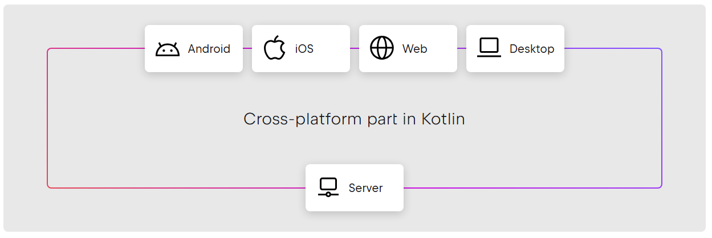

## 1.2. 为什么考虑 KMP

我们知道目前使用比较广的两个跨端技术是 RN 和 Flutter，包括我们内部也在使用 Flutter 进行跨端的开发。它们特点是在原生平台上构建一个 Runtime 的环境，通过与原生环境进行桥接，来开发在 UI 及逻辑上具有一致性的应用。

它们的**优势**：

*   一套代码实现 UI、逻辑上的一致性

也存在一些**劣势**：

*   使用非原生的语言开发，有中间层的交互，在性能上会存在损耗
    
*   非原生语言以及开发套件在也存在比较大的学习成本，上手难度较大
    

而 KMP 的思路是编写一套代码，编译为原生平台语言，直接提供给各平台执行，不存在中间层。

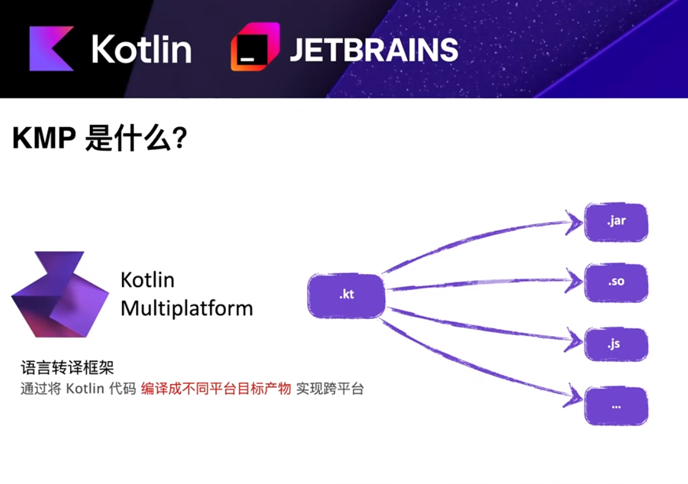

**优势：**

*   直接编译为原生平台语言，性能上无损耗
    
*   开发语言及工具为 Kotlin + Gradle，没什么附加成本，上手难度较低
    

**劣势：**

*   不支持 UI 上的跨端，需要额外依赖 Compose Mutiplatform，暂不支持鸿蒙，需要额外适配
    

业内也有部分厂商使用 Compose Mutiplatform 实现 UI 跨端，但由于目前 Compose Mutiplatform 官方尚不支持鸿蒙，如需支持得另外做适配、移植工作，工作量较大，所以暂不考虑 UI 上的跨平台。

  

由于鸿蒙业务 SDK 属于纯业务逻辑的 SDK，不存在 UI，所以选择使用 KMP 比较合适，无性能损耗，而且上手难度较低。

## 1.3. 可行性

### 1.3.1. 如何支持鸿蒙

#### 1.3.1.1. Kotlin/JS & Kotlin/Native

鸿蒙官方推荐的开发方式使用的主要开发语言是 ArkTS，[同时也支持 JavaScript、TypeScript 开发代码逻辑](https://developer.huawei.com/consumer/cn/doc/harmonyos-guides-V5/arkts-migration-background-V5#方舟运行时兼容tsjs)，并且以 napi 的形式提供了与 C 的互操作能力。所以理论上只要能通过 Kotlin 生成 JS 或者 C 的编译产物，都可以实现使用 Kotlin 代码开发鸿蒙。

KMP 提供了 [Kotlin/Native](https://kotlinlang.org/docs/native-overview.html#how-to-get-started)  来针对特定平台编译产生 C 产物，直接运行在特定平台，但官方目前不支持产出针对鸿蒙平台的 .so 产物，需要额外适配，工作量较大，无法快速走通流程，因此当下暂不做考虑。

KMP 中 [Kotlin/JS](https://kotlinlang.org/docs/js-overview.html) 用于将 Kotlin 代码编译为 JS 产物，我们可以直接使用 Kotlin/JS 进行开发，产出 JS 代码提供给鸿蒙项目使用：

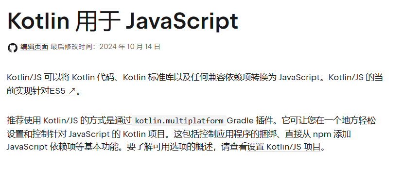

#### 1.3.1.2. 调用鸿蒙 API

Kotlin 提供 external 关键字来声明对应类、方法、属性由外部提供。

鸿蒙官方也提供了 .d.ts 声明文件对外开放其 API。

想使用鸿蒙的 API，我们需要把 .d.ts 文件转换为 Kotlin 中的 external 声明。

以 hilog 为例，其 .d.ts 文件如下

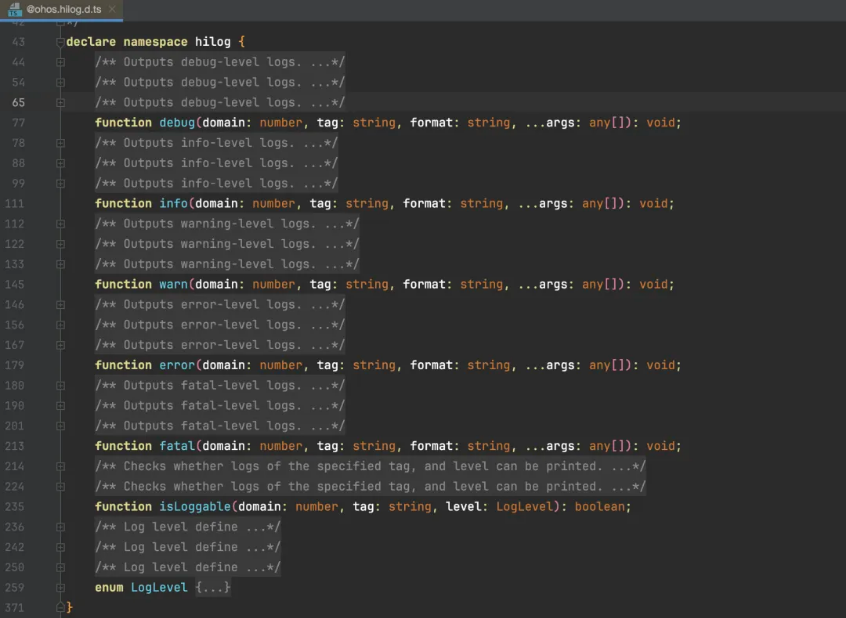

Kotlin 中则为如下的声明形式：

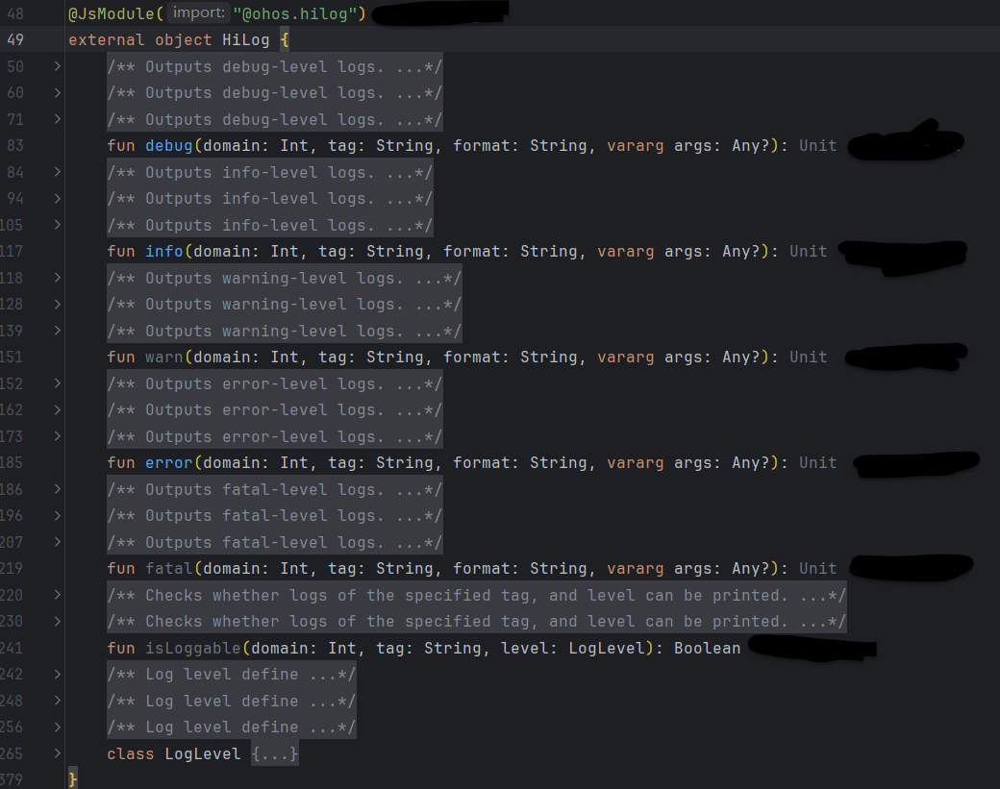

之后就可直接在 KMP 项目中直接调用了：

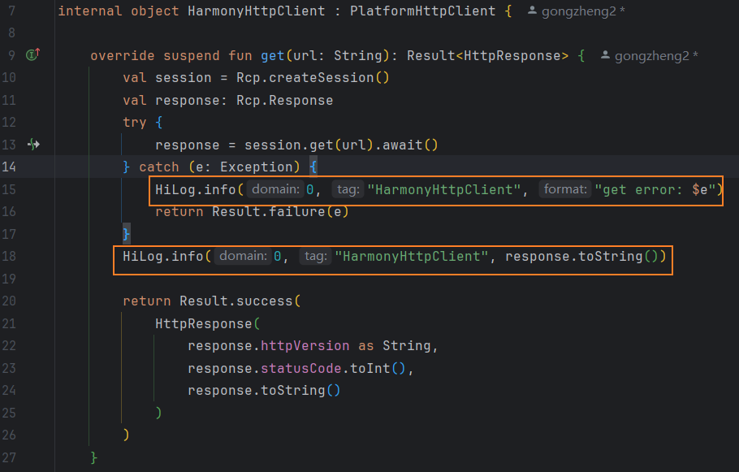

  

### 1.3.2. API 稳定性

Kotlin Multiplatform 所支持平台的[稳定性级别](https://www.jetbrains.com.cn/en-us/help/kotlin-multiplatform-dev/supported-platforms.html#current-platform-stability-levels-for-the-core-kotlin-multiplatform-technology)：

| Platform（平台） | Stability level（稳定级别） |
| --- | --- |
| Android | Stable |
| iOS | Stable |
| Desktop (JVM) | Stable |
| Server-side (JVM) | Stable |
| Web based on Kotlin/Wasm | Alpha |
| Web based on Kotlin/JS | Stable |
| watchOS | Best effort |
| tvOS | Best effort |

*   Stable 表示：放心使用。后续也会将根据严格的[向后兼容性规则](https://kotlinfoundation.org/language-committee-guidelines/)进行开发
*   Alpha 表示：使用有风险，自行决定是否要使用
*   Best effort 表示：仅供使用。如果发展好，就继续，否则就放弃

[Kotlin Multiplatform is Stable](https://kotlinlang.org/docs/whatsnew1920.html#kotlin-multiplatform-is-stable)：

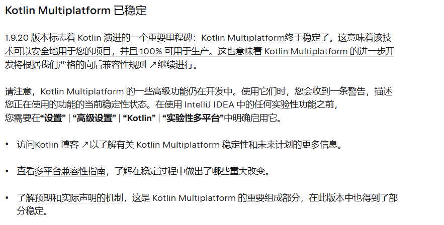

  

# 2. 鸿蒙业务 SDK KMP 实现方案

## 2.1. KMP 项目结构

Tragets 概念。一个项目中可以有不同的 targets 目标平台，这代表着最终 Kotlin 代码会编译为对应平台的产物。

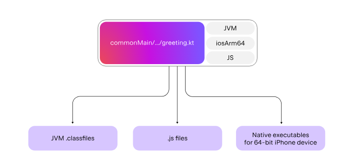

SourceSet 概念。如下结构的 KMP 项目有 3 个 sourceSet，commonMain 中的代码会编译到所有 targets 目标平台上，其他 sourceSet 代码则编译到特定平台中。

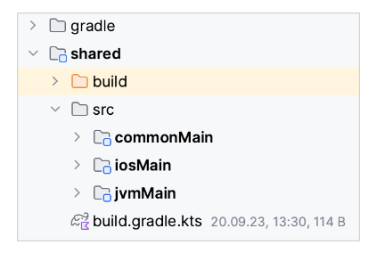

如下的项目中，包含 3 个 Targets 和 4 个 SourceSet。

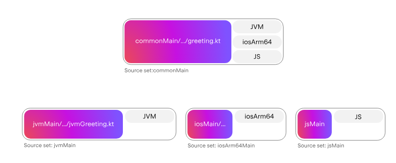

其编译产物如下（以 JVM target 平台举例）

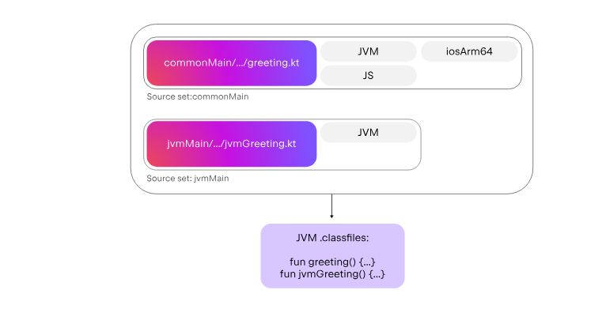

对于适配鸿蒙、安卓双端的项目，我们就需要 2 个 targets Android 和 JS，3 个 sourceSet，commonMain、androidMain 和 jsMain。

把通用的代码放在 commonMain 里，Android 平台特定代码放在 androidMain，鸿蒙平台特定的代码放在 jsMain 里。

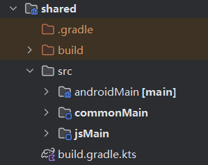

## 2.2. KMP 鸿蒙 SDK 架构

鸿蒙业务 SDK 迁移至 KMP，项目架构做如下调整：

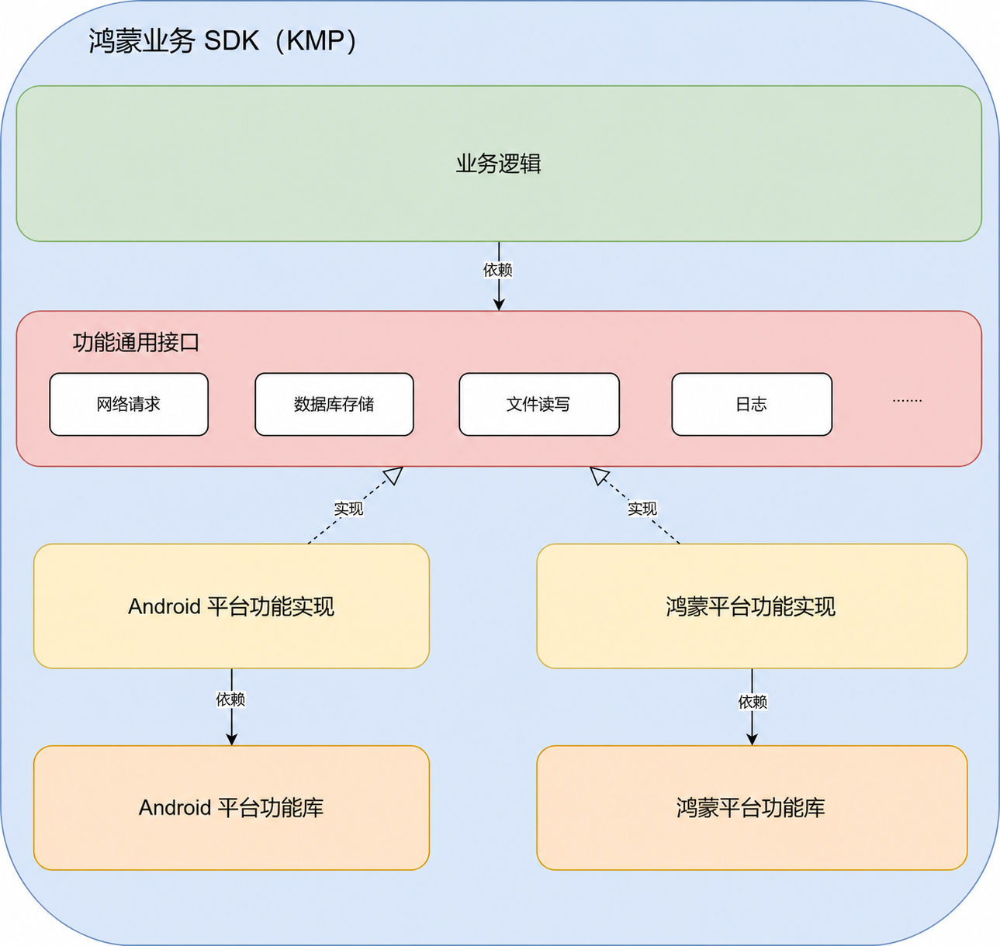

KMP 中对应的 SourceSet：

  

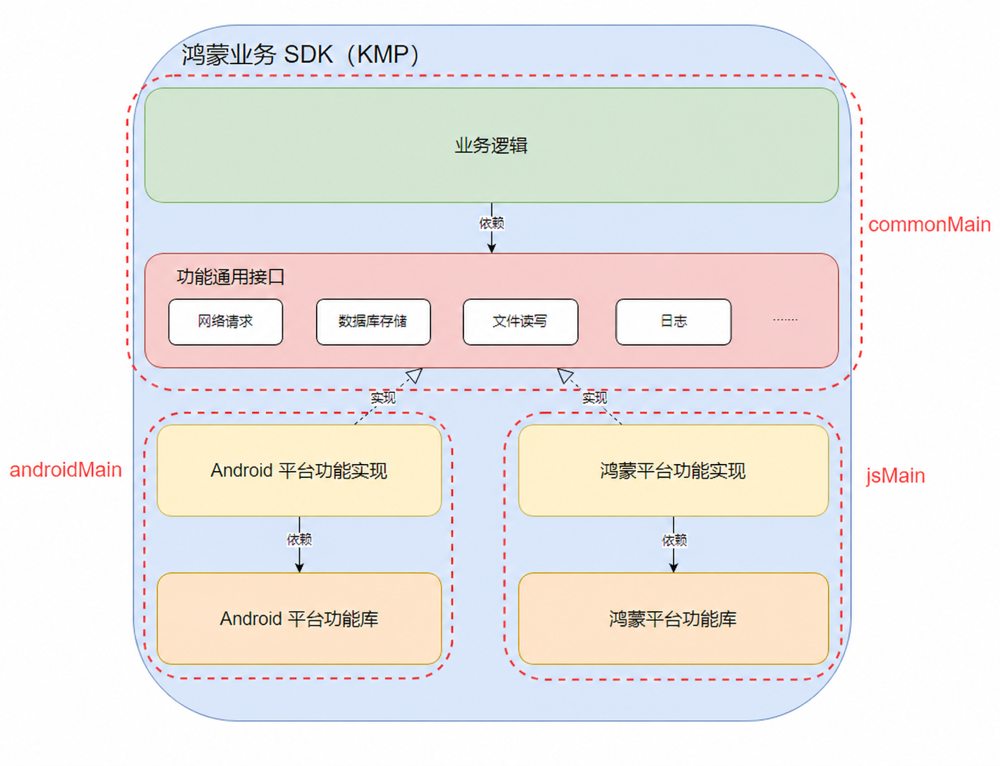

  

示例代码：

1.  功能通用接口（commonMain）  
    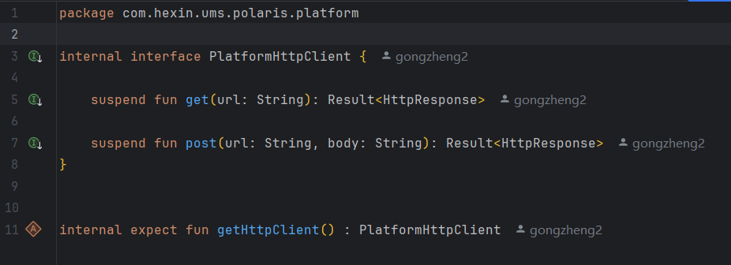
    
      
    
2.  鸿蒙实现（jsMain）  
    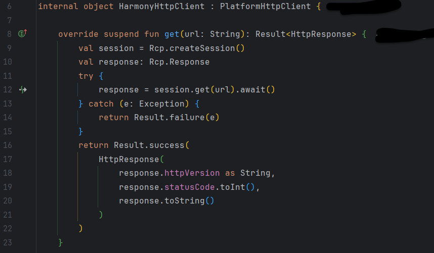
    
      
    
3.  安卓实现（androidMain）  
    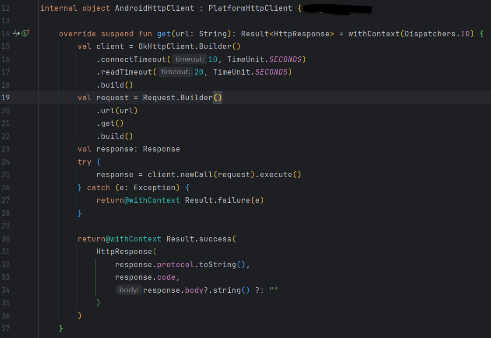
    

  

# 3. 现存的问题

1.  **版本兼容性问题**。由于 KMP 于 1.9.20 版本稳定，又由于一些依赖及编译问题，且为提高兼容性尽可能降低版本，最后选用 Kotlin 1.9.25 版本。Kotlin 版本较高，并且对 Gradle、AGP 版本均存在要求，低版本 Gradle/AGP/Kotlin 可能存在兼容性问题：  
    [版本兼容性](https://kotlinlang.org/docs/multiplatform-compatibility-guide.html#version-compatibility)  
    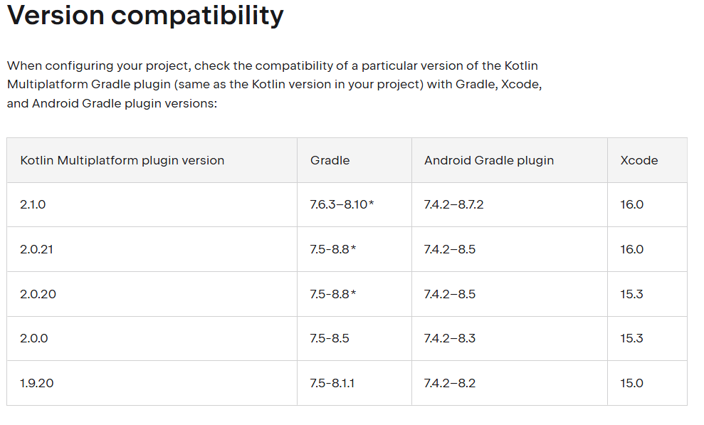
    
2.  **Kotlin/JS 应用于鸿蒙，不具备多线程编程能力**。Kotlin/JS 产物为 JS，本质是单线程模型，采用异步操作避免 IO 耗时问题。JS 的多线程编程也存在，但依赖于运行环境，如 浏览器、Node.js，放在鸿蒙端则依赖鸿蒙的多线程能力，而鸿蒙端的多线程方式 TaskPool/Worker 与鸿蒙平台强关联，使用到 ArkTS 装饰器，或者需要手动在 DevEco Studio 鸿蒙项目层级中进行文件配置，因此 Kotlin/JS 无法使用鸿蒙端的多线程能力。  
    
    目前的方案是安卓使用子线程处理逻辑，鸿蒙使用异步方式处理。  
    
3.  **KMP 跨端库对鸿蒙适配性不好，非直接可用。**部分跨端库如网络请求 Ktor、数据库 Sqldelight 等涉及到 JS 平台环境特定 API，鸿蒙无对应环境 API，需要做额外适配工作才能使用。  
    
    方案一： 自己做平台通用功能接口的设计，并使用各平台依赖进行实现。  
    
            优势：对于简单功能，可以设计简易接口即可使用，不需要适配三方库。  
            劣势：如果需要用到复杂功能，接口设计的成本是比较高的，不如对跨端库进行鸿蒙适配，直接使用跨端库设计的接口。  
    
    方案二：看能否适配三方跨端库，将其中的 jsMain 使用的 API 改为鸿蒙端的 API，直接使用跨端库提供相关功能。  
    
            优势：如果可以成功适配，直接使用跨端库即可，不需要自己设计接口，且 Android 端跨端库中 androidMain 基本都已经实现，不需要自己实现。  
            劣势：每个三方跨端库都进行鸿蒙适配，成本较高，且后期三方库需要升级变动可能也需要再次适配。  
    
    可以两个方案相结合，简单功能自己设计实现，复杂功能看是否可以将三方库进行鸿蒙适配。  
    
4.  **KMP 项目鸿蒙端调试成本较高。**无法直接与 Kotlin 代码对应，调试编译生成的 js 代码较困难，尤其用到 Kotlin 协程之后编译出来的 js 代码会更加复杂。  
    
    需要在日志层面进行重视。

# 4. 未来展望

1.  能否可以有一套通用的 KMP 项目架构，能够应对其他项目/组件的使用场景？  
    
    下图中，功能通用接口与各平台实现，可考虑进行单独的封装，比如后期可以作为基础功能库，来为 KMP 项目提供基础功能。  
    
    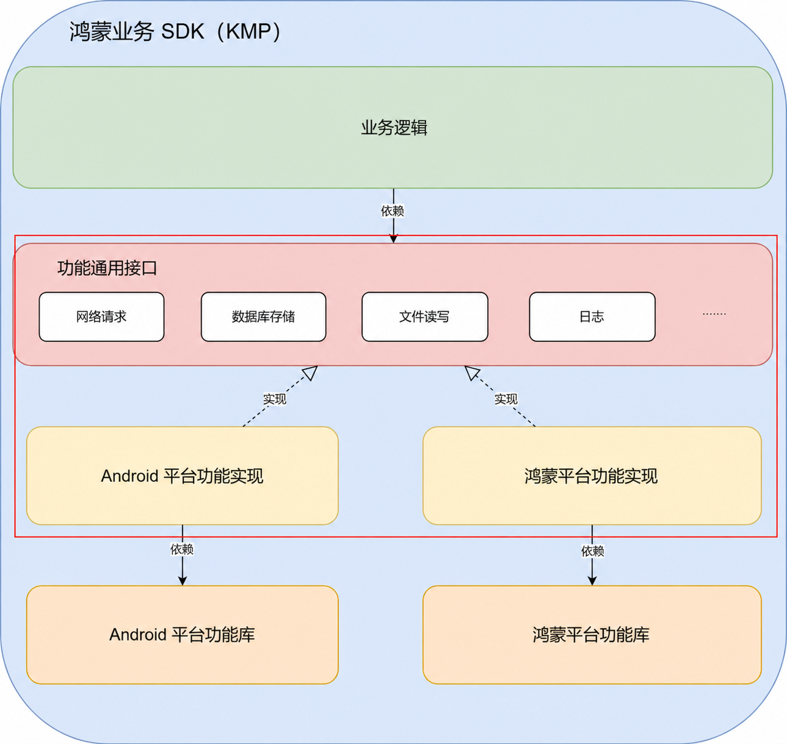
    
      
    
2.  Kotlin/Native   
    Kotlin 直接编译为 .so 库，提供给鸿蒙平台使用，鸿蒙侧使用 napi 与 C 进行交互，性能上会优于鸿蒙原生，对多线程支持好，但 Kotlin/Native 尚不支持鸿蒙，基建建设适配的成本比较高。  
    目前腾讯视频、bilibili、快手、QQ 等大厂团队已实现基于 Kotlin/Native 的鸿蒙适配方案。  
    
    腾讯视频使用 Kotlin/Native + Compose 适配鸿蒙，逻辑 + UI  
    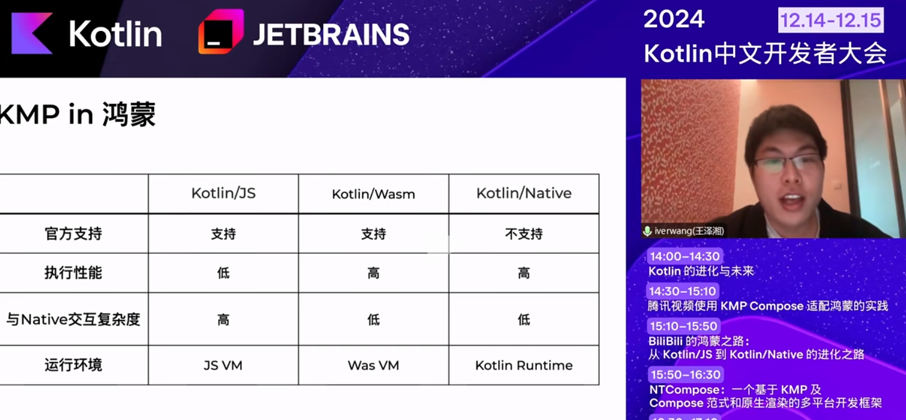
    
    
    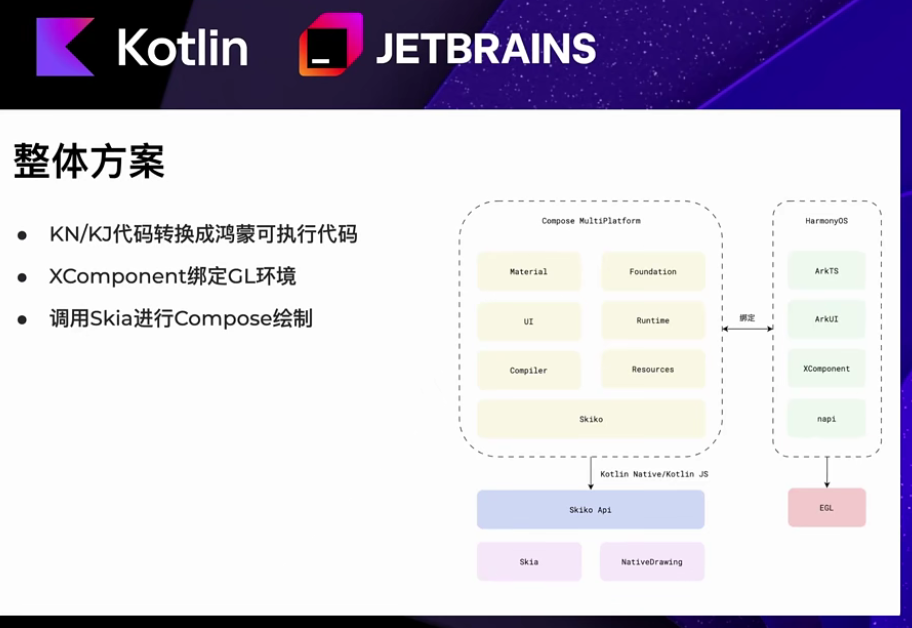
    
      
    
    bilibili 使用 Kotlin/Native 实现逻辑层跨端，UI 使用 ArkTS 原生  
    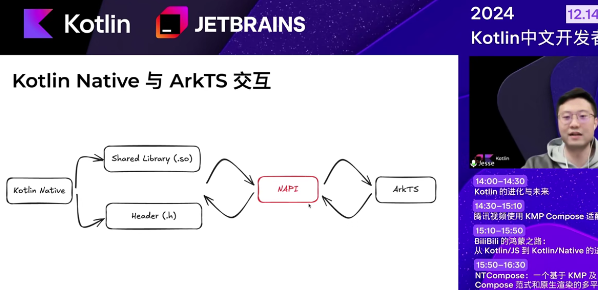
    
      
    
    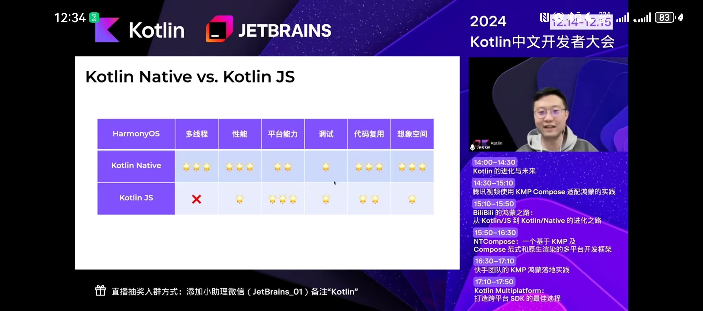
    
    
    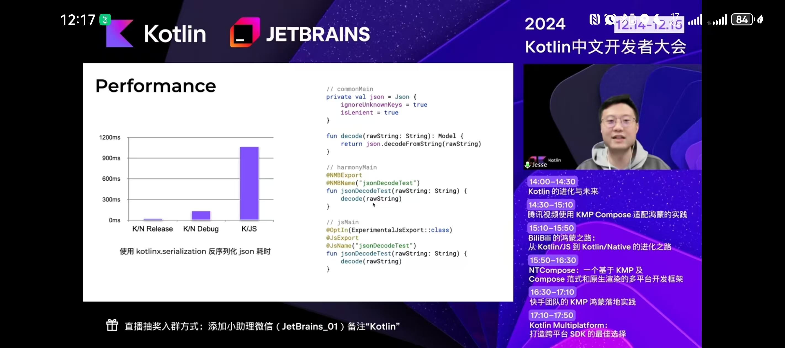
    
      
    
    QQ 使用 Kotlin/Native + 自研 NTCompose 实现 逻辑 + UI 跨端  
    
    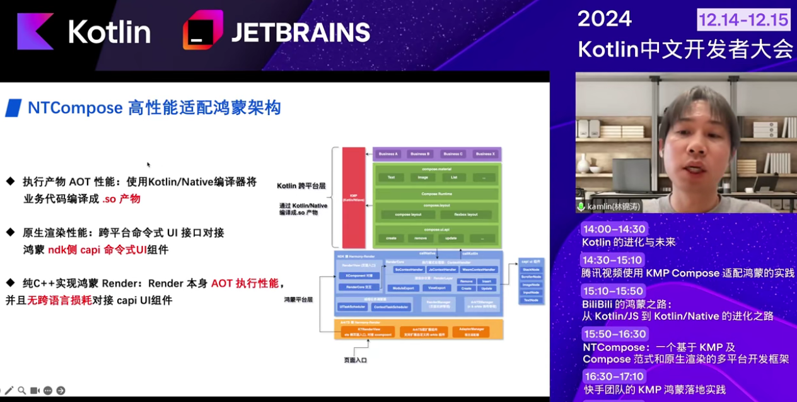
    
      
    
    快手使用 Kotlin/Native 实现逻辑跨端  
    
    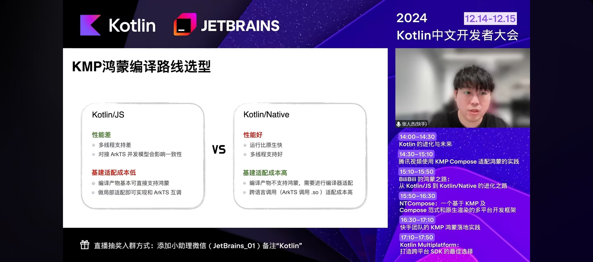
    
      
    
    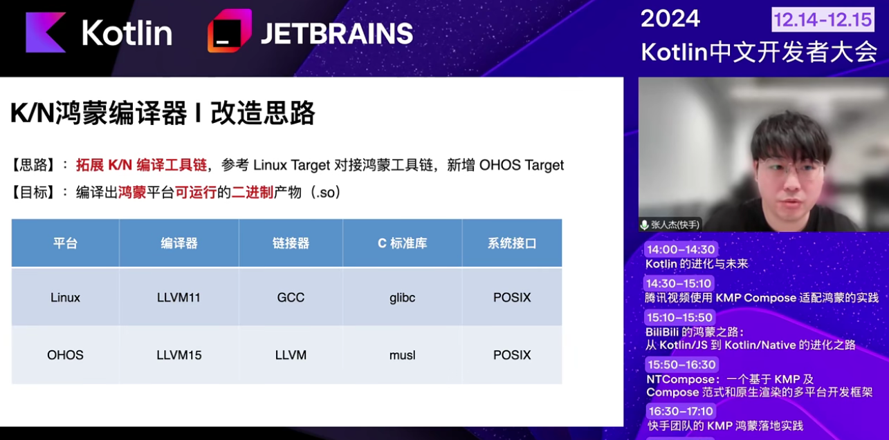
    

  

# 5. 结论

KMP 兼容性问题，调试成本，推广落地成本仍然较高，暂且持续观察其发展吧，以上视作一种思路的探索。

# 6. 资料整理

## 6.1. 介绍&实践

*   [采用 Kotlin Multiplatform 做跨平台](https://wjrye.github.io/2024/06/01/Kotlin-Multiplatform-Intro)
    
*   [Kotlin Multiplatform 跨平台支持鸿蒙](https://wjrye.github.io/2024/06/12/Kotlin-Multiplatform-Support-Harmony/)
    
*   [使用KMP & Compose开发鸿蒙应用](https://mp.weixin.qq.com/s/QQ2tiAlInT5YRjracJ0OWg)
    
*   [Bilibili 基于Kotlin Multiplatform的鸿蒙跨平台开发实践](https://mp.weixin.qq.com/s/UajaKomk8XQTwn3BWLo6gw)
    
*   [Blibili 工程化视角的 Kotlin Multiplatform 核心解读及优化](https://mp.weixin.qq.com/s/nRmwpSGlFgvROs1lRVuAIw)
    

## 6.2. KMP API 稳定性

*   [KMP 稳定性](https://www.jetbrains.com.cn/en-us/help/kotlin-multiplatform-dev/supported-platforms.html#current-platform-stability-levels-for-the-core-kotlin-multiplatform-technology)
    
*   [KMP 组件稳定性](https://kotlinlang.org/docs/components-stability.html#github-badges-for-kotlin-components)
    

## 6.3. 案例&三方库

*   [KMP 官方总结项目案例](https://www.jetbrains.com.cn/en-us/help/kotlin-multiplatform-dev/multiplatform-samples.html)
    
*   [KMP 库列表](https://libs.kmp.icerock.dev/)
    
*   [GitHub KMP 库整理 1](https://github.com/terrakok/kmp-awesome)
    
*   [GitHub KMP 库整理 2](https://github.com/AAkira/Kotlin-Multiplatform-Libraries)
    

## 6.4. KMP API 与开发方式

*   [KMP 介绍](https://kotlinlang.org/docs/multiplatform-intro.html)
    
*   [KMP 项目基本结构](https://kotlinlang.org/docs/multiplatform-discover-project.html)
    
    *   通用代码与平台特定代码
    
*   [KMP 项目层次结构-中间层](https://kotlinlang.org/docs/multiplatform-hierarchy.html)
    
*   [except 和 actual 关键字](https://kotlinlang.org/docs/multiplatform-expect-actual.html)
    
    *   在通用代码中提供平台无关的 API，commonMain 中定义 except，具体平台代码定义 actual 实现。类似于接口。
        
    *   非必要情况请直接使用接口而不是 except class
    
*   [依赖的添加](https://kotlinlang.org/docs/multiplatform-add-dependencies.html)
    
    *   [Android 依赖添加](https://kotlinlang.org/docs/multiplatform-android-dependencies.html)
    
*   [编译配置](https://kotlinlang.org/docs/multiplatform-configure-compilations.html#configure-compilations-for-one-target)
    

## 6.5. Kotlin/JS 文档

*   [js-project-setup](https://kotlinlang.org/docs/js-project-setup.html) Kotlin/JS 项目构建、插件配置
    
    KMP 插件 js {} dsl 闭包中一些 API介绍：
    
    *   useEsModules 编译产物产出 .mjs, .mjs.map 文件，为 JavaScript 的 ES6 模块文件（ES Modules，简称 ESM），用于严格遵循 ECMAScript 2015 及后续标准的模块化方式。**鸿蒙项目无法直接识别，内容需要修改为 .js, .js.map，但必须使用该方式**
        
    *   [useCommonJs](https://kotlinlang.org/docs/js-modules.html#javascript-libraries-and-node-js-files) 编译产物直接产出 .js， .js.map 文件。鸿蒙项目可直接识别，**但不能使用该方式，模块导入导出[与鸿蒙 ESM 方式存在冲突](https://developer.huawei.com/consumer/cn/doc/harmonyos-guides-V5/module-principle-V5#commonjs%E4%B8%8Ees-module%E6%94%AF%E6%8C%81%E8%A7%84%E6%A0%BC)**
        
    *   [CommonJS 与 ESM 中鸿蒙的支持情况](https://developer.huawei.com/consumer/cn/doc/harmonyos-guides-V5/module-principle-V5#commonjs%E4%B8%8Ees-module%E6%94%AF%E6%8C%81%E8%A7%84%E6%A0%BC)
        
    *   [generateTypeScriptDefinitions](https://kotlinlang.org/docs/js-ir-compiler.html#preview-generation-of-typescript-declaration-files-d-ts) 生成 d.ts 文件，TypeScript 的声明文件，用于描述现有 JavaScript 库或模块的类型信息。帮助 TypeScript 进行类型检查，使 TypeScript 项目可以使用 JavaScript 库并获得类型提示和静态检查支持。
    
*   [KMP API 参考文档](https://kotlinlang.org/docs/multiplatform-dsl-reference.html)
    
*   [Kotlin 中使用 JS](https://kotlinlang.org/docs/js-interop.html)
    
    介绍一些针对 JS 平台的语法特性，
    
    *   比如 Kotlin/JS 中的 `===` 与 `==` 号对标 JS
        
    *   external 关键字
        
    *   JS 中的 prototype 共享属性
    
*   [Dynamic 类型](https://kotlinlang.org/docs/dynamic-type.html)
    
    与 JS 这类没有静态类型的语言进行互操作。这在使用没有类型定义的 JavaScript 库和 API 时尤其有用。
    
*   [使用 nmp 库中的依赖](https://kotlinlang.org/docs/using-packages-from-npm.html)
    
    *   `@JsModule`
        
    *   `@JsNonModule`
    
*   [JS 中使用 Kotlin](https://kotlinlang.org/docs/js-to-kotlin-interop.html)
    
*   [官方入门文档](https://www.jetbrains.com.cn/en-us/help/kotlin-multiplatform-dev/get-started.html)
    
*   [Kotlin 官方对 JS 对象的封装库，Record/Date/Void...](https://github.com/JetBrains/kotlin-wrappers?tab=readme-ov-file)
    

## 6.6. 鸿蒙相关 API 整理

*   鸿蒙获取应用版本：[https://developer.huawei.com/consumer/cn/doc/harmonyos-references-V5/js-apis-bundlemanager-bundleinfo-V5](https://developer.huawei.com/consumer/cn/doc/harmonyos-references-V5/js-apis-bundlemanager-bundleinfo-V5)
    
*   鸿蒙设备信息：[https://developer.huawei.com/consumer/cn/doc/harmonyos-references-V5/js-apis-device-info-V5](https://developer.huawei.com/consumer/cn/doc/harmonyos-references-V5/js-apis-device-info-V5)
    
*   SIM 卡信息（PLMN = MCC + MNC）：[https://developer.huawei.com/consumer/cn/doc/architecture-guides/develop-app-2-0000002069457038](https://developer.huawei.com/consumer/cn/doc/architecture-guides/develop-app-2-0000002069457038)
    
*   如何获取网络类型：Wi-Fi，3G，4G，5G等：[https://developer.huawei.com/consumer/cn/doc/harmonyos-faqs-V5/faqs-network-54-V5](https://developer.huawei.com/consumer/cn/doc/harmonyos-faqs-V5/faqs-network-54-V5)
    
*   Android 设备唯一标识：[https://juejin.cn/post/7418075685766168613](https://juejin.cn/post/7418075685766168613) [https://developer.android.com/identity/user-data-ids?hl=zh-cn](https://developer.android.com/identity/user-data-ids?hl=zh-cn)
    
*   如何获取手机屏幕信息：[https://developer.huawei.com/consumer/cn/doc/harmonyos-faqs-V5/faqs-arkui-242-V5](https://developer.huawei.com/consumer/cn/doc/harmonyos-faqs-V5/faqs-arkui-242-V5)
    
    屏幕信息属性：[https://developer.huawei.com/consumer/cn/doc/harmonyos-references-V5/js-apis-display-V5](https://developer.huawei.com/consumer/cn/doc/harmonyos-references-V5/js-apis-display-V5)
